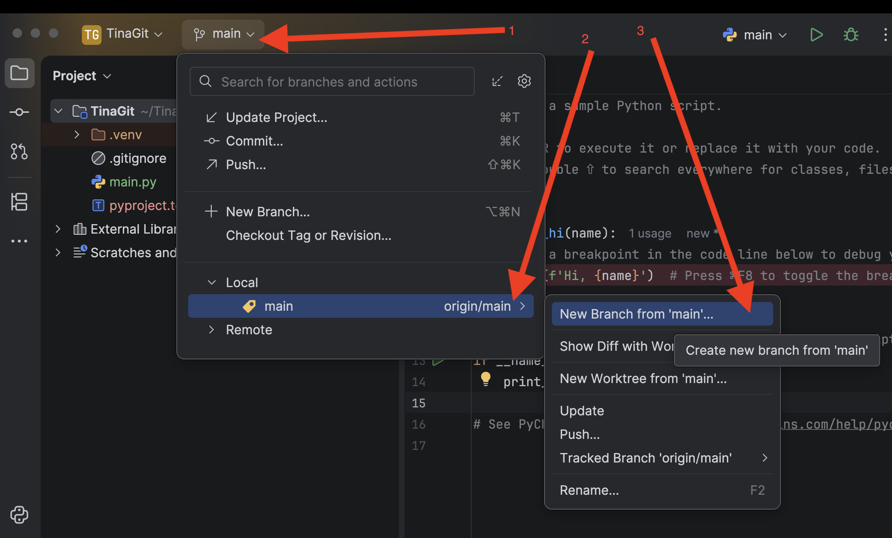
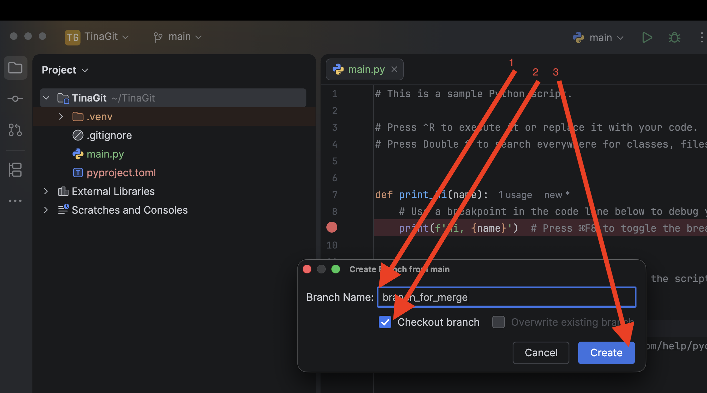
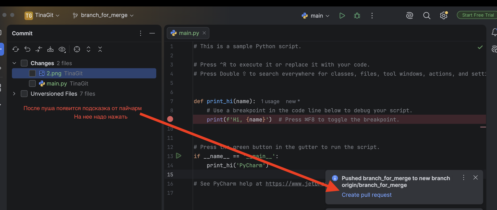
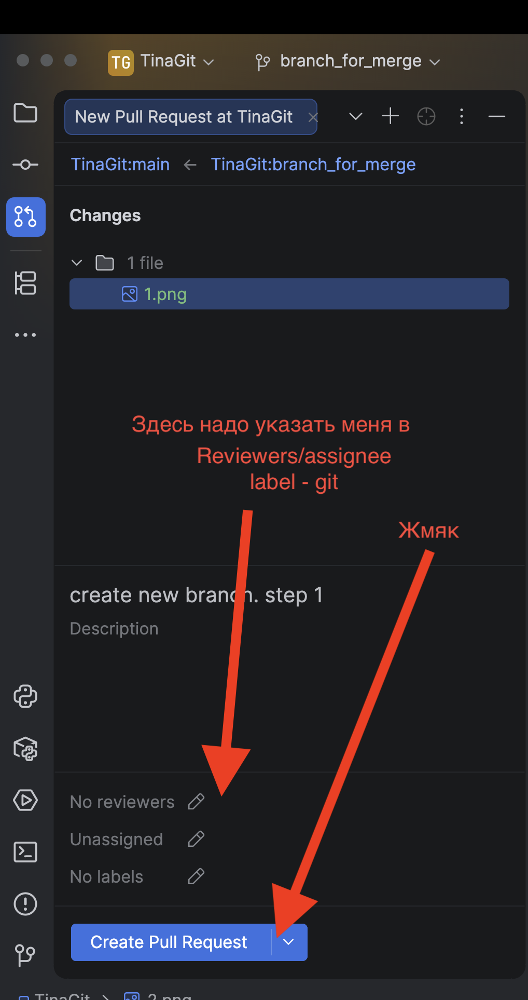
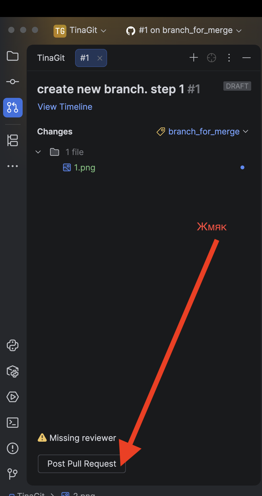

1. Нажать на "main"
   

2. Придумать оригинальное,
   но логичное имя для ветки,
   оставить "checkout"
   (это автоматичкески переключит на создаваемую ветку),
   и нажать "Create"
   
3. Через всплывшую подсказку создать пул-реквест
   
4. Здесь надо будет указать кто должен проверять твой реквест
   
5. Нажать кнопу
   